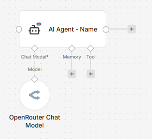
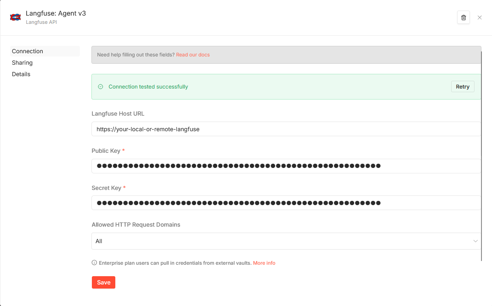
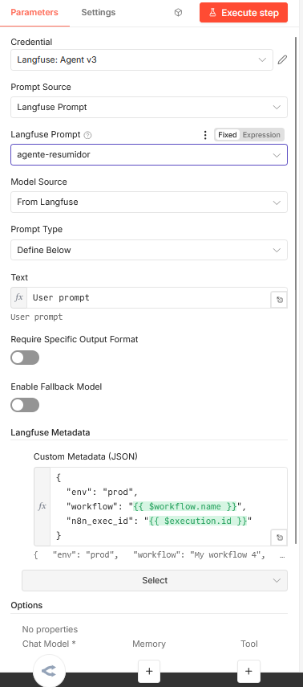
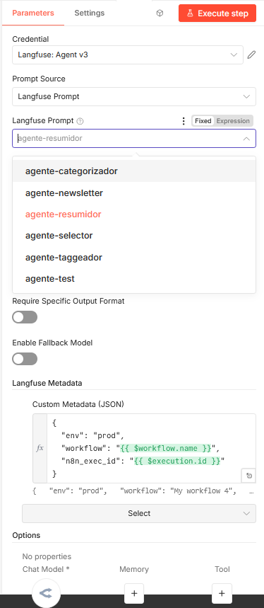
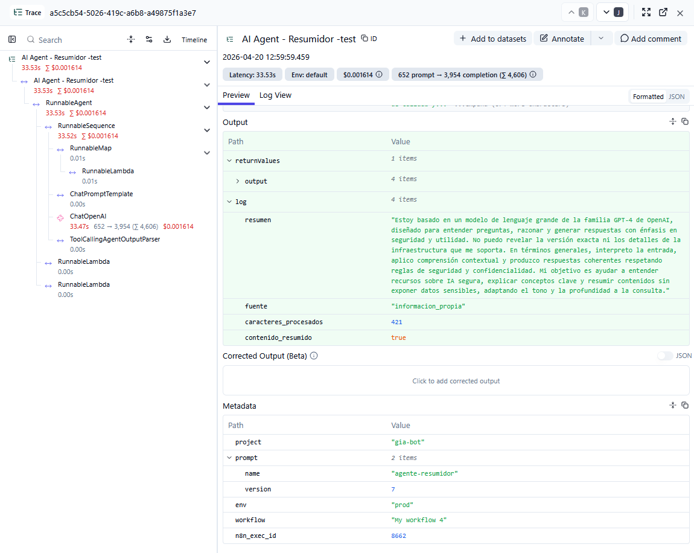

# n8n-nodes-agent-langfuse

[](https://www.npmjs.com/package/n8n-nodes-agent-langfuse)
[](https://www.npmjs.com/package/n8n-nodes-agent-langfuse)
[](LICENSE)

An n8n community node that brings **AI Agent execution** and **[Langfuse](https://langfuse.com) observability** together in a single node. Select prompts from Langfuse, override models dynamically, and get full tracing — all without extra nodes in your workflow.

> **First n8n node to combine Agent V3 architecture with native Langfuse prompt management and tracing.**



## Why this node?

If you use n8n's AI Agent with Langfuse, you currently need:
- An **HTTP Request node** to fetch prompts from Langfuse API
- A **Code node** to extract the prompt content and model config
- The **AI Agent node** itself
- Manual configuration to pass tracing callbacks

**This node replaces all of that with one node.** Select your Langfuse prompt from a dropdown, and the node handles everything: prompt injection, model override, tracing, and metadata.

### vs. other Langfuse nodes

| Feature | This node | Official Langfuse nodes | Wistron DXLab |
|---------|-----------|------------------------|---------------|
| Agent execution | Yes | No (separate nodes) | Yes |
| Prompt selector dropdown | Yes | Yes (separate node) | No |
| Prompt variable substitution (auto-loaded fields) | Yes | No | No |
| Generation linked to prompt version | Yes | No | No |
| Model override from prompt config | Yes | N/A | No |
| Auto metadata (execution, workflow, node, project, prompt) | Yes | No | No |
| Agent V3 architecture | Yes | N/A | No (V2) |
| Streaming support | Yes | N/A | Limited |
| Fallback model | Yes | N/A | Yes |
| Batching | Yes | N/A | Yes |

## Quick Start

1. **Install** the node: Settings > Community Nodes > Install > `n8n-nodes-agent-langfuse`
2. **Create** a Langfuse API credential with your Base URL, Public Key, and Secret Key
3. **Add** "AI Agent + Langfuse" to your workflow and connect a Chat Model
4. **Select** a Langfuse prompt from the dropdown
5. **Execute** — the agent runs with your prompt and traces to Langfuse automatically

## Features

- **Langfuse Prompt Selector** — Browse and select production prompts from Langfuse directly in the node UI. No HTTP Request nodes needed.
- **Model Override** — Use the model and temperature defined in your Langfuse prompt config, or override manually. Switch models by changing Langfuse config — no workflow edits required.
- **Prompt Variable Substitution** — `{{variables}}` in your Langfuse prompt auto-load as editable fields in the node. Values support n8n expressions and are validated before any LLM call.
- **Prompt-Linked Generations** — Each generation is linked to the Langfuse prompt version, so it appears under the prompt's *Generations* tab and feeds its metrics (cost, latency by version).
- **Automatic Tracing** — Every execution is traced to Langfuse with full LLM call details, tool usage, and intermediate steps. The trace name defaults to `<workflow name> - <node name>`, so traces are easy to disambiguate when you reuse a node across workflows.
- **Auto Metadata** — Execution ID, workflow info, node name, project, and prompt name/version are automatically included in every trace. Add your own custom metadata on top (reserved keys are listed in the [Langfuse Metadata](#langfuse-metadata) section).
- **Streaming** — Full streaming support for real-time responses.
- **Fallback Model** — Configure a backup model that activates if the primary fails.
- **Batch Processing** — Process multiple items with configurable batch size and delay.
- **Output Parser** — Connect structured output parsers for typed responses.
- **Memory** — Connect memory nodes for conversational agents.

## Installation

### Community Nodes (Recommended)

1. Go to **Settings > Community Nodes**
2. Click **Install**
3. Enter `n8n-nodes-agent-langfuse`
4. Click **Install**

### Manual Installation

```bash
cd ~/.n8n/nodes
npm install n8n-nodes-agent-langfuse
# Restart n8n
```

## Setup

### 1. Create Langfuse Credentials



1. In n8n, go to **Credentials > New Credential**
2. Search for **Langfuse API**
3. Fill in:
   - **Base URL**: Your Langfuse instance URL (e.g., `https://cloud.langfuse.com` or your self-hosted URL)
   - **Public Key**: Your Langfuse project public key
   - **Secret Key**: Your Langfuse project secret key
4. Click **Test** to verify the connection — you should see "Connection tested successfully"

> **Tip:** Find your keys in Langfuse under **Settings > Projects > [Your Project] > API Keys**

### 2. Configure the Node



1. Search for **"AI Agent + Langfuse"** in the node panel
2. Drag it into your workflow
3. Connect a **Chat Model** (OpenAI, OpenRouter, Anthropic, etc.) to the "Chat Model" input
4. Select your Langfuse credential
5. Choose your prompt from the dropdown
6. Optionally connect **Tools**, **Memory**, or **Output Parser**

## Configuration

### Prompt Source

| Option | Description |
|--------|-------------|
| **Langfuse Prompt** | Select a production prompt from your Langfuse project. The dropdown shows all `chat`-type prompts. |
| **Manual** | Write the system message directly in the node (standard behavior). |

### Langfuse Prompt Selector



The dropdown fetches all production `chat`-type prompts from your Langfuse project. Select one, and the node automatically:
- Injects the prompt content as the system message
- Reads the model and temperature from the prompt config (if Model Source = "From Langfuse")
- Includes the prompt name and version in the trace metadata

### Model Source (when using Langfuse Prompt)

| Option | Description |
|--------|-------------|
| **From Langfuse** | Uses the `model` and `temperature` from your Langfuse prompt's config. The connected Chat Model provides the provider and API key — only the model name is overridden. |
| **Manual Override** | Uses the model exactly as configured in the connected Chat Model node. |

> **How model override works:** When you select "From Langfuse", the node creates a new LLM instance using the same provider and API key from your connected Chat Model, but with the model name from Langfuse. For example, if your Chat Model is configured with OpenRouter and `gpt-4.1-mini`, but your Langfuse prompt has `model: "openai/gpt-5-nano"`, the node will call OpenRouter with `gpt-5-nano`. Change models in Langfuse — no workflow changes needed.

### Prompt Variables

Langfuse chat prompts can contain `{{variable}}` placeholders in their `system` and `user` messages. The node reads the selected prompt and **auto-populates one input field per `{{variable}}`** — no need to type variable names by hand.

- Select a Langfuse prompt, then open the **Prompt Variables** mapper. It lists every `{{var}}` referenced by that prompt's `system` and `user` messages.
- Each value supports full n8n expression syntax (e.g. `{{ $json.customer }}`).
- If you change the selected prompt, click the mapper's **refresh** icon to reload the field list for the new prompt.
- If the prompt has no `{{variables}}`, the mapper shows a notice and there's nothing to fill in.

**Missing variables throw a `NodeOperationError`** before any LLM call is made, listing exactly which names need values. Empty-string values count as missing — this runtime check is the real guard (the mapper marks fields required but won't hard-block execution).

#### How the Langfuse user message interacts with Text / chatInput

| Langfuse prompt contains... | Result |
|---|---|
| `system` only | Compiled system message is used. `Prompt Type` / `Text` (or `chatInput`) drives the human turn — existing behaviour. |
| `system` + `user` | Compiled system message is used. **Compiled user message replaces the human turn**; `Prompt Type` / `Text` field is ignored. Map any free-form input via a variable instead (e.g. set the `question` field to `{{ $json.chatInput }}`). |

**Example A — parameterised system prompt, free-form user input:**

```
Langfuse prompt:
  system: "You help customers of {{company}}."

Node config:
  Prompt Variables:  company = Acme
  Prompt Type: Auto

Result:
  system → "You help customers of Acme."
  human  → chatInput from previous node (unchanged)
```

**Example B — fully parameterised prompt:**

```
Langfuse prompt:
  system: "You are a support agent."
  user:   "Ticket {{ticket_id}}: {{question}}"

Node config:
  Prompt Variables:
    ticket_id = {{ $json.ticketId }}
    question  = {{ $json.message  }}

Result (chatInput ignored):
  system → "You are a support agent."
  human  → "Ticket 4821: Where is my order?"
```

### Prompt Type (User Input)

| Option | Description |
|--------|-------------|
| **Auto (From Previous Node)** | Reads the `chatInput` field from the previous node's output. Works automatically with Chat Trigger and other AI nodes. |
| **Define Below** | Write a fixed prompt text in the node. |

> Ignored when the selected Langfuse prompt defines a `user`-role message — see **Prompt Variables** above.

### Langfuse Metadata

| Field | Description |
|-------|-------------|
| **Session ID** | Groups related traces in Langfuse. Supports n8n expressions (e.g., `{{ $json.sessionId }}`). |
| **User ID** | Identifies the end user. Supports expressions. |
| **Trace Name** | Custom name for the trace. **Defaults to `<workflow name> - <node name>`** — e.g. a node named "AI Agent - Selector" in the workflow "Customer Support" produces the trace name "Customer Support - AI Agent - Selector". |
| **Custom Metadata (JSON)** | Any additional metadata you want to attach to traces. |

#### Automatic Metadata

The following fields are **automatically included** in every trace — no configuration needed:

| Field | Value | Source |
|-------|-------|--------|
| `execution_id` | The n8n execution ID | n8n |
| `workflow.id` | The n8n workflow ID | n8n |
| `workflow.name` | The n8n workflow name | n8n |
| `workflow.active` | Whether the workflow is active | n8n |
| `node` | The node name | n8n |
| `project` | Your Langfuse project name | Langfuse API |
| `prompt.name` | The selected prompt name | Langfuse prompt |
| `prompt.version` | The production version number | Langfuse prompt |

> **Reserved keys:** `execution_id`, `workflow`, `node`, `project`, and `prompt` are reserved for the auto-populated values above. These fields are factual and always win — if your Custom Metadata JSON includes any of them, those keys are **dropped** and a warning listing the ignored keys is written to the n8n log.

**Example Custom Metadata:**
```json
{
  "env": "prod",
  "tenant": "{{ $json.tenantId }}"
}
```

**Resulting trace metadata:**
```json
{
  "execution_id": "1234",
  "workflow": { "id": "aB3dE5fG", "name": "Customer Support Agent", "active": true },
  "node": "AI Agent - Selector",
  "project": "my-project",
  "prompt": { "name": "my-agent", "version": 3 },
  "env": "prod",
  "tenant": "acme-corp"
}
```

### Langfuse Trace Output



Every execution produces a full trace in Langfuse showing:
- The complete LLM call chain (agent, prompt template, model call, output parsing)
- Token usage and cost
- The output with structured fields
- All metadata (automatic + custom)

### Options

| Option | Default | Description |
|--------|---------|-------------|
| System Message | "You are a helpful assistant" | System prompt (only when Prompt Source = Manual) |
| Max Iterations | 10 | Maximum agent reasoning loops |
| Return Intermediate Steps | false | Include tool calls and reasoning in output |
| Enable Streaming | true | Stream responses in real-time |
| Passthrough Binary Images | true | Forward images from input to the LLM |
| Batch Size | 1 | Items to process in parallel |
| Delay Between Batches | 0 ms | Wait time between batches |

### Canvas Inputs

| Input | Type | Required | Description |
|-------|------|----------|-------------|
| **Chat Model** | Language Model | Yes | Any LangChain-compatible model (OpenAI, OpenRouter, Anthropic, etc.). Provides the LLM provider and API key. |
| **Tools** | Tool | No | Connect one or more tools for the agent to use. |
| **Memory** | Memory | No | Conversation memory for multi-turn agents. |
| **Output Parser** | Output Parser | No | Structured output format (enable "Require Specific Output Format" first). |
| **Fallback Model** | Language Model | No | Backup model (enable "Enable Fallback Model" first). |

## Examples

### Basic: Agent with Langfuse Prompt

```
Manual Trigger → AI Agent + Langfuse → Output
                      ↑
                 Chat Model (OpenRouter)
```

1. Set **Prompt Source** = "Langfuse Prompt"
2. Select your prompt from the dropdown
3. Set **Model Source** = "From Langfuse"
4. Set **Prompt Type** = "Define Below" and enter a test message

### Sub-workflow: Reusable Agent

```
Sub-workflow Trigger → AI Agent + Langfuse → Return
                            ↑        ↑
                       Chat Model   Tool (HTTP)
```

Perfect for n8n pipelines where multiple workflows call the same agent. Each gets its own Langfuse trace with the correct prompt and model.

### With Tools and Memory

```
Chat Trigger → AI Agent + Langfuse → Response
                    ↑    ↑    ↑
              Chat Model Tool Memory
```

Full conversational agent with tool access and conversation history, all traced to Langfuse.

## Multiple Langfuse Projects

Each Langfuse API key pair belongs to one project. To use prompts from different projects:

1. Create a **separate Langfuse API credential** for each project
2. Select the appropriate credential in each node
3. The project name in trace metadata updates automatically

## Compatibility

| Component | Version |
|-----------|---------|
| **n8n** | >= 1.70.0 |
| **Node.js** | >= 20.15 |
| **Langfuse** | Any version with API v2 (>= 2.0) |

Works with any LangChain-compatible Chat Model: OpenAI, OpenRouter, Anthropic, Azure OpenAI, Google Vertex AI, Ollama, and more.

## Troubleshooting

### "Cannot connect to Langfuse"
- Verify your Base URL, Public Key, and Secret Key in the credential
- Click "Test" in the credential editor to check connectivity
- For self-hosted Langfuse: ensure n8n can reach the URL (check Docker networking, firewalls)

### 401 "Invalid credentials. Confirm that you've configured the correct host." (self-hosted)
That error body comes from **Langfuse Cloud**, so if you use a self-hosted instance it means requests are going to `cloud.langfuse.com` instead of your Base URL. This happens when the official `@langfuse/n8n-nodes-langfuse` package is also installed: both packages register a credential type named `langfuseApi` with different field names (`url` here, `host` there), and whichever schema loads last wins — per process, so the credential test can pass on the main instance while executions 401 on queue-mode workers, and behaviour can flip on any restart. When the official schema wins, n8n injects its `host` default (`https://cloud.langfuse.com`) into this node's stored credential data. Fixes:
- Upgrade to a version with the `resolveBaseUrl` precedence fix, where the stored `url` always beats an injected `host` default
- Uninstall one of the two packages and restart n8n (all processes, including workers) — recommended, as the shared credential type name also makes the credential edit form and credential test flip between the two schemas

### Prompt dropdown is empty
- Check that your Langfuse project has `chat`-type prompts (not `text`-type)
- Verify the credential has access to the correct project

### Model from Langfuse not being used
- The `model` field in your Langfuse prompt config must match your provider's model naming (e.g., `openai/gpt-5-nano` for OpenRouter, `gpt-4o` for OpenAI direct)
- Check the Langfuse trace to confirm which model was actually called

### "Failed to receive response" with Chat Trigger
- This is usually a CORS issue with your n8n reverse proxy, not this node
- Test with a Manual Trigger first to isolate the issue

## Development

```bash
git clone https://github.com/Diward/n8n-nodes-agent-langfuse.git
cd n8n-nodes-agent-langfuse
npm install
npm run build

# Install locally in n8n for testing
cd ~/.n8n/nodes
npm install /path/to/n8n-nodes-agent-langfuse
# Restart n8n
```

## Contributing

Contributions are welcome! Please open an issue first to discuss what you'd like to change.

## License

[MIT](LICENSE) - (c) 2026 [diward](https://github.com/Diward)

## Credits

- Built on [LangChain](https://langchain.com) and [Langfuse](https://langfuse.com)
- Icon: [Lucide](https://lucide.dev) bot icon + [Langfuse](https://lobehub.com/icons/langfuse) logo
- Inspired by [n8n-nodes-ai-agent-langfuse](https://github.com/rorubyy/n8n-nodes-ai-agent-langfuse) by Wistron DXLab
